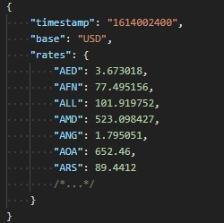
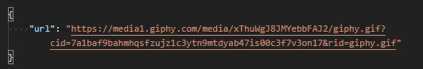

# Инструкция по работе с API
API предоставляет GIF в зависимости от того повысился ли курс валюты или нет.
При отправке запроса, наш сервис отправляет запрос на openexchangerates.org/api
где мы получаем курсы валют, далее мы сравниваем курс за сегодняшний день и вчерашний
день (параметр дней можно редактировать из properties файла). В зависимости
от того повысился или уменьшился курс, отправляет запрос на api.giphy.com/v1/gifs/
где получаем определенное количество gif(так же редактируется из файла) и из списка
выбирается одна случайная gif, и эта gif возвращается в ответе с нашего API.

Для работы с api, нужно склонировать проект.

###1. Базовый путь API: localhost:8080/currency/api/v1

По этому адресу получаем все курсы валют в таком формате:

###2. Получение GIF localhost:8080/currency/api/v1/USD

Для того чтобы получить GIF, 
необходимо отправить запрос на 
http://localhost:8080/currency/api/v1/{Параметр_валюты}
Параметр_валюты может быть следующим: USD,EUR,RUB и так далее

####базовый функционал предоставляет возможность смотреть только по USD
(если у вас есть расширенный openexchangerates.app_id, можно его заменить 
в файле properties и делать запросы ддя любой валюты)
Получаем в ответ ссылку на Gif, которую уже можно будет использовать на фронте

###3. Файл application.properties изменение параметров

В application.properties содержатся параметры для редактирования запроса

1. giphy.api_key - используется для обращения к внешнему API получения GIF
2. openexchangerates.app_id - используется для обращения к внешнему API получения валют
3. currency.rate - валюта по отношению к которой будем смотреть,
может быть любым, из списка, который получаем по запросу localhost:8080/currency/api/v1
например RUB или EUR
4. currency.days_ago - используется для того, чтобы сравнить текущий курс валюты,
с валютой на момент времени равный этому параметру (дни)
5. gif.limit - количество получаемых GIF в запросе (не может быть больше 50)
из которых рандомно выбирается одна GIF
6. search.gif.good_day - параметр поиска, по которому будут искаться и выдаваться гиф
если курс валюты больше чем в другие дни
7. search.gif.bad_day - параметр поиска, по которому будут искаться и выдаваться гиф
если курс валюты меньше чем в другие дни

###4. Демонстрация

По адресу http://localhost:8080/ можно посмотреть как примерно это будет выглядеть,
параметры из файла properties к данному адресу не применяются, здесь лишь примерная демонстрация.

